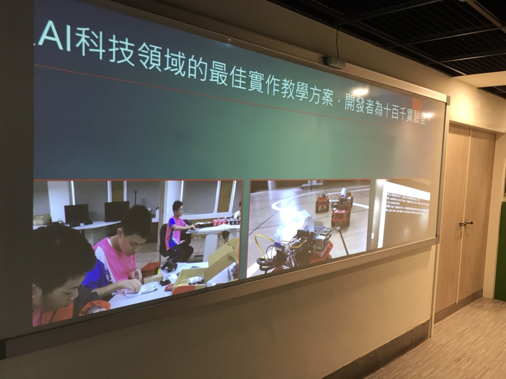

# Sound Event Detection with YAMNet on Raspberry Pi 3
## Proof of concept
1. [Raspberry Pi 3 Model B+](https://www.raspberrypi.org/products/raspberry-pi-3-model-b-plus/) and [Voice HAT microphone](https://aiyprojects.withgoogle.com/voice-v1/) are good enough
1. [Headless boot up and SSH in](https://medium.com/十百千實驗室/一小時入門樹莓派-bdc986cdb238)
1. Clone this repo  
`git clone https://github.com/x1001000/raspberrypi3-yamnet-sed`
1. Install dependencies, drivers, and configs  
`bash raspberrypi3-yamnet-sed/install-deps.sh`
1. Reboot to take effect  
`sudo reboot`
1. Run SED  
`cd && cd raspberrypi3-yamnet-sed/yamnet && python3 sed.py`
1. There you go!
## References
1. https://github.com/tensorflow/hub/blob/master/examples/colab/yamnet.ipynb
1. https://github.com/tensorflow/models/tree/master/research/audioset
1. https://github.com/Qengineering/Tensorflow-Raspberry-Pi/
1. https://github.com/tensorflow/tensorflow/issues/44467
1. https://github.com/hellmanj/AIY-voice-kit-python/blob/master/HACKING.md
1. https://people.csail.mit.edu/hubert/pyaudio/
## To be continued

